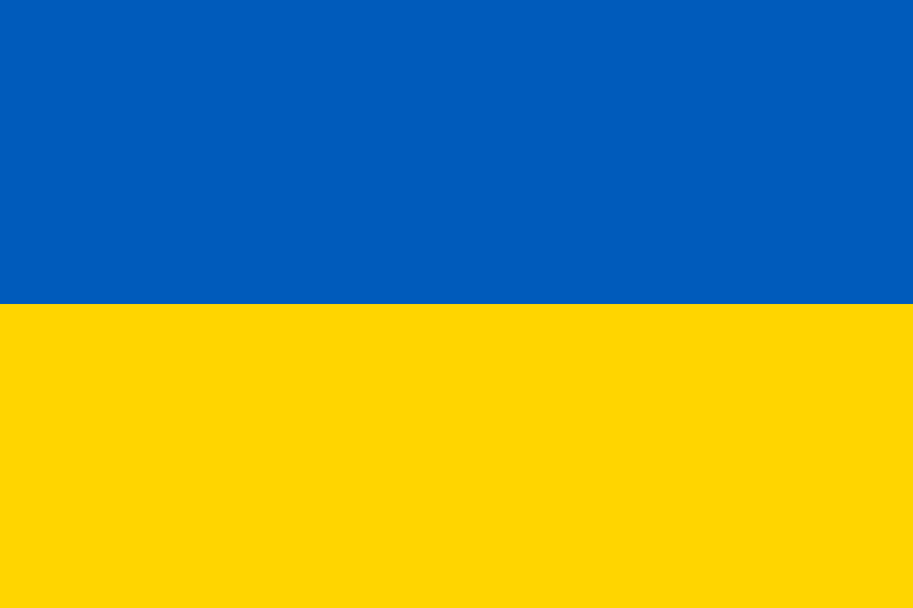

## Overview

Ukrainian Flag
This is the Ukrainian flag 🇺🇦 1/1. Funds raised from this sale will be directed to helping the Ukrainian civilians suffering from the war initiated by Putin. "Come Back Alive," one of the most effective and transparent Ukrainian charitable and volunteer initiatives can be found at: https://savelife.in.ua This project has been organized by Pussy Riot, Trippy Labs, PleasrDAO, CXIP, and many Ukrainian humanitarian activists working tirelessly on the ground and generously consulting with us to assure we have a safe place to direct our donations that will help those who need it the most. Much support and love to Ukraine 🇺🇦

Backwards Compatible Template for Foundry and DappTools Projects.

## Development Tools

Uses [Foundry](https://github.com/gaskonst/foundry). Installation instructions are included below.

## Blueprint

```ml
lib
├─ ds-test — https://github.com/dapphub/ds-test
├─ forge-std — https://github.com/brockelmore/forge-std
src
├─ tests
│  └─ UkraineDAO_NFT.t — "UkraineDAO_NFT Tests"
└─ UkraineDAO_NFT — NFT for Ukraine DAO"
```

## Development

**Setup**

```bash
make
# OR #
make setup
```

**Building**

```bash
make build
```

**Testing**

```bash
make test
```

**Deployment & Verification**

Inside the [`scripts/`](./scripts/) directory are a few preconfigured scripts that can be used to deploy and verify contracts.

Scripts take inputs from the cli, using silent mode to hide any sensitive information.

NOTE: These scripts are required to be _executable_ meaning they must be made executable by running `chmod +x ./scripts/*`.

NOTE: For local deployment, make sure to run `yarn` or `npm install` before running the `deploy_local.sh` script. Otherwise, hardhat will error due to missing dependencies.

NOTE: these scripts will prompt you for the contract name and deployed addresses (when verifying). Also, they use the `-i` flag on `forge` to ask for your private key for deployment. This uses silent mode which keeps your private key from being printed to the console (and visible in logs).

### First time with Forge/Foundry?

See the official Foundry installation [instructions](https://github.com/gakonst/foundry/blob/master/README.md#installation).

Don't have [rust](https://www.rust-lang.org/tools/install) installed?
Run

```bash
curl --proto '=https' --tlsv1.2 -sSf https://sh.rustup.rs | sh
```

Then, install the [foundry](https://github.com/gakonst/foundry) toolchain installer (`foundryup`) with:

```bash
curl -L https://foundry.paradigm.xyz | bash
```

Now that you've installed the `foundryup` binary,
anytime you need to get the latest `forge` or `cast` binaries,
you can run `foundryup`.

So, simply execute:

```bash
foundryup
```

🎉 Foundry is installed! 🎉

### Writing Tests with Foundry

With [Foundry](https://gakonst.xyz), tests are written in Solidity! 🥳

Create a test file for your contract in the `src/tests/` directory.

### Configure Foundry

Using [foundry.toml](./foundry.toml), Foundry is easily configurable.

## License

[AGPL-3.0-only](https://github.com/cxip/UkraineDAO_NFT/blob/master/LICENSE)

## Disclaimer

_These smart contracts are being provided as is. No guarantee, representation or warranty is being made, express or implied, as to the safety or correctness of the user interface or the smart contracts. They have not been audited and as such there can be no assurance they will work as intended, and users may experience delays, failures, errors, omissions, loss of transmitted information or loss of funds. The creators are not liable for any of the foregoing. Users should proceed with caution and use at their own risk._
